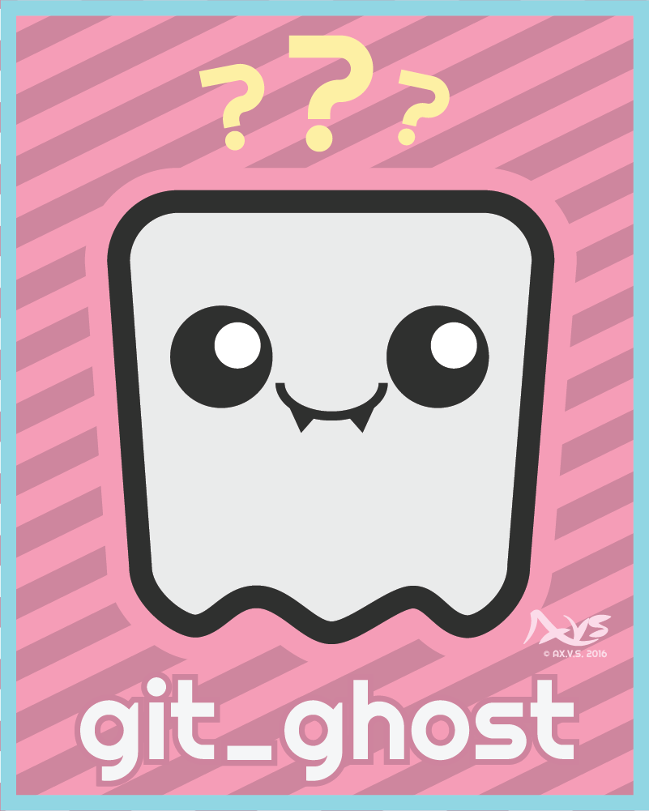

git-ghost is a Python library and CLI tool engineered for managing multiple Git cloud accounts, particularly when one is a personal account vulnerable to doxing and the others are high-stakes or high-visibility projects. Certain projects can attract significant attention, and hostile actors. 

Developers may encounter situations where maintaining a separation between their public and private digital identities is crucial. git-ghost offers solutions for anonymizing Git configuration credentials and commit metadata, which obfuscates the shared ownership of accounts. My hope is that this will limit malicious discoverability of personal accounts and be a layer of protection again doxing, extortion and harm we or our loved ones might face.

# Understanding the Risk Vector in Git
Git metadata, including user.name and user.email, can inadvertently link multiple accounts when displayed on public git clouds. Intended for tracking within organizations, this feature becomes a risk online, exposing users to doxing or extortion. git-ghost anonymizes this metadata, protecting users by preventing the unintentional linking of their digital identities.

# Installation

This repo holds the source files in which I build and distribute git_ghost from but to use you would install it using pip instead of downloading it here.

Ensure Python 3.x is installed on your system.

```bash
pip install git_ghost
```
# Core Features:

## Anonymize User Configuration
Anonymize your user meta data in .gitconfig globally or locally:

``` sh
git-ghost ghost-user --config-level global
git-ghost ghost-user --config-level local -gm chaos
```

## Make an Anonymous Commit
Automatically anonymize user metadata per each commit:
``` sh
git-ghost commit -m "Feature update" -gm chaos
```
For a detailed description of all commands and options, see the sections below.

---

# Why git-ghost?
Consider Jane, who has two GitHub accounts: one personal and one for a project with a ***passionate*** and potentially intrusive or hostile user base. The overlap between personal and project identities poses a doxing risk. git-ghost addresses this challenge by anonymizing the user.name and user.email metadata associated with Git commits, making it harder to trace different accounts back to Jane.

While Jane could do this manually with great dilligence there is always the risk of a single mistake which could leak her identity resulting in a permenant leaking of her identity. I use git-ghost in this way to ensure I can't make mistakes.

## Project Status: Alpha

Please note that git-ghost is currently in alpha. It has been developed to meet my specific needs and has not been extensively vetted for all possible use cases. While I find it sufficiently robust for my purposes, I encourage users to approach it with caution and to thoroughly test it within their own environments before relying on it for sensitive operations.  

# Commands
## git-ghost ghost-user
**git-ghost** provides a number of ghosting methods to remove your identity entirely from a local or global .gitconfig.

Examples:
```
git-ghost ghost-user --config-level global
git-ghost ghost-user --config-level local
git-ghost ghost-user -cl global -gm chaos
```

Please ensure the results are correct in DOCUMENTS/USER/.gitconfig for GLOBAL or .git/.gitconfig for local within a repo.

### --config-level (-cl)
Effect the global config or the local config at the command line address.

### --ghost-method (-gm)
Decides the ghosting method to use to obfuscate the user.name and user.email. See bellow for what these do.

* empty
* chaos

## git-ghost commit
For the top ghosting I could devise this function replaces the regular git commit command and automatically ghosts your user meta data uniquely per commit. If you only ghost once on your account theoretically a motivated enough doxer could do searches and discover the same scrambled email or user.name has posted to other accounts. By providing a unique obfuscation to every single commit there's no possible way to connect the account directly outside of speculating that they both used similar obfuscation practices but even then the personal account would have to be discovered somehow and analyzed. 

Examples:
```
git-ghost commit

git-ghost commit -gm chaos

git-ghost commit -m "My Commit" -gm empty -y

git-ghost commit -mp -v
```

### --message, -m
The commit message.

### --message_prompt, -mp
Prompt to enter the commit message, instead of providing one.

### --ghost-method, -gm
Decides the ghosting method to use to obfuscate the user.name and user.email. See below for what these do.

### --verbose, -v
Increase the verbosity of the logging

### --no-confirm, -y
Skip the confirmation input requirement.

### --ghost-method, -gm
Decides the ghosting method to use to obfuscate the user.name and user.email. See below for what these do.

* empty
* chaos


# Ghosting Methods
## GhostMethod: Empty

Fills in both user.name and user.email with an empty string.

Results:
``` sh
user.name = ""
user.email = ""
```

***A nuance is that github and gitcloud will fill in your user.name with the commit name in it's GUI.***

With this ghost-mode ***git-ghost commit** is not as need because there are most likely plenty of users that already use empty credentials making it a harder thing to search and find reliable connected accounts.

## GhostMethod: Chaos
Chaos results in a random alpha-numeric sequence, with the only rule being that it starts with a letter character.

Results (Example): 
``` sh
user.name = "a823vj23iowe"
user.email = "e23@g0923.com"
```

Chaos has the disadvantage that the randomized output it makes could still be used to find connections between github accounts. git-ghost commit -gh chaos will solve this making each commit unique.


# Copyright and Brand Artwork Usage

The git-ghost brand and associated graphics are copyrighted by AX.V.S ©2016. Please see the [Brand Artwork Usage Guidelines](ARTWORK_AND_BRANDING.md) for details on how to correctly use the brand assets.

---
Thanks for visiting!

